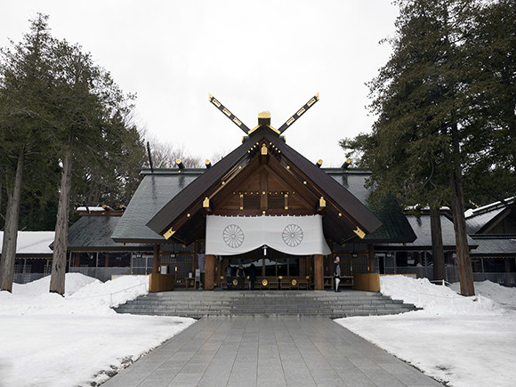

# 일본여행 

## 숙소 
1. https://kr.hotels.com/ho508034/?pa=17&q-check-out=2018-12-24&tab=description&q-room-0-adults=4&YGF=14&q-check-in=2018-12-20&MGT=4&WOE=1&WOD=4&ZSX=0&SYE=3&q-room-0-children=0
2. https://kr.hotels.com/ho682236/?pa=16&q-check-out=2018-12-24&tab=description&q-room-0-adults=4&YGF=14&q-check-in=2018-12-20&MGT=4&WOE=1&WOD=4&ZSX=0&SYE=3&q-room-0-children=0
3. https://kr.hotels.com/ho265302/?pa=11&q-check-out=2018-12-24&tab=description&q-room-0-adults=4&YGF=14&q-check-in=2018-12-20&MGT=4&WOE=1&WOD=4&ZSX=0&SYE=3&q-room-0-children=0

호텔이름|더 스테이 삿포로|그리즈 삿포로|삿포로 파크 호텔|
---|---|---|---|
등급|2성급|2성급|4성급|
가격(1인 기준)|약 3만원|약 2만 5천원|약 5만원|
가격(할인 비적용)|약 3만3천원|약 3만 8천원|약 5만 8천원|
근처 지하철역|걸어서 10분 이내|걸어서 10분 이내|걸어서 10분 이내| 
침실||||
거리(from 공항, km)|40|40|39|
후기(총합평점/이용후기수)|8.2 / 159|8.8 / 37|8.8 / 601|

## 여행지 

### 전망대 

이름|JR타워 전망실T38|모이와산|
---|---|---|
교통|삿포로 역 앞|로프웨이 이리구치역에서 로프웨이 탐|
영업시간|10 ~ 23| 11 ~ 22, 마지막 로프웨이 21:30|
입장료(엔)|720| 1700(왕복요금)|
전망|||

### 공원, 산책

장소 | 도미타 꽃밭 | 오도리 공원 | 삿포로 예술의 숲 야외 미술관 | 오타루 운하 |
---|---|---|---|---|
교통| 겨울이라 |니시핫초메 역에서 10분 이내|근처에 지하철 X 존나멈|오타루역에서 20분 걸음|
편리성| 꽃이 없다| 유명하긴 한데 겨울이라 추울듯 | 가지마 ㅅㅂ | 오타루역이 삿포로에서 존나 멈|
입장시간| X | X | 9:45 ~ 17 | X|
사진 | | ||
|

### Speical, 구분 불가

장소 | 삿포로 맥주박물관 | 홋카이도 신궁 | 죠잔케이 온천 | 마루야마 동물원 | 구본청사 | 오르골 박물관 |
---|---|---|---|---|---|---|
교통 | 삿포로 역에서 2km, 버스로 7분| 니시니주핫초메 역에서 걸어서 15분 | 시내에서 버스로 1시간| 홋카이도 신궁에서 걸어서 15분 | 삿포로역에서 10분 이내| 미나미 오타루역에허 걸어서 15분 | 
영업시간 | 공장견학 9:30 ~ 15, 1:30 소요 |7 ~ 16| ???| 9:30 ~ 16 | 8:45 ~ 18| 9 ~ 18|
입장료 | 500, 예약 필요 | free | 당일 온천 및 투어로 3000엔 이내| 600 | 무료 | free |
사진 | |||||

## 이벤트 
 
pass 

## 음식 

## 쇼핑 

# total tripㅇ